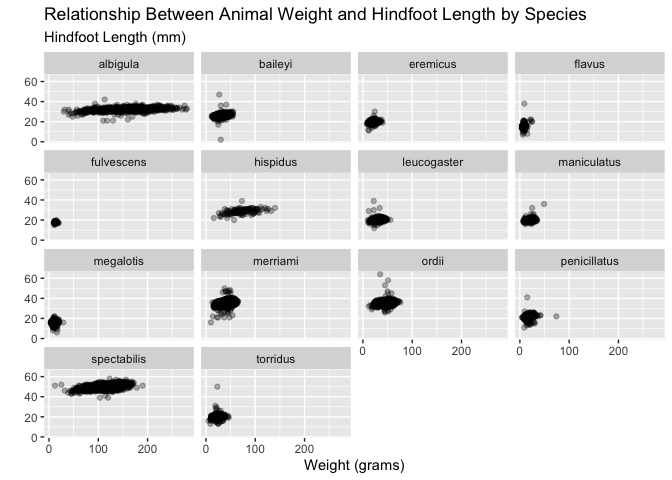
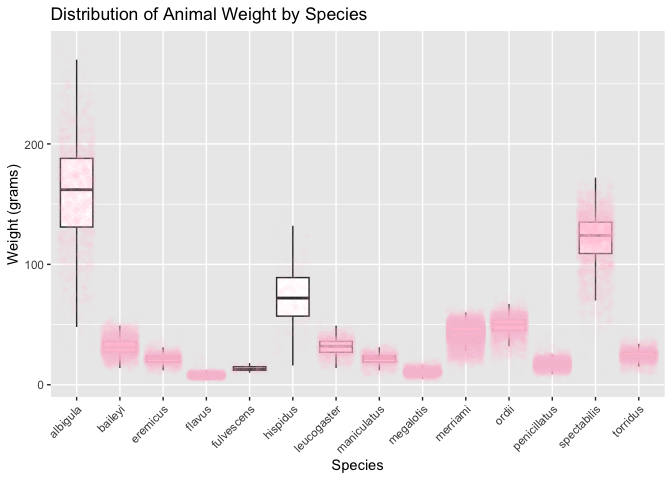
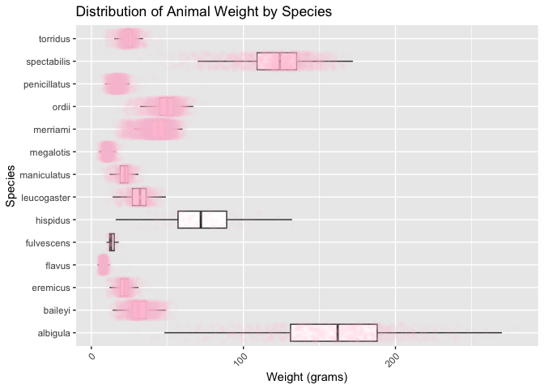

# Lab 3: Exploring Rodents with `ggplot2`
Gurpreet Kaur

# Part 1: Setup

## GitHub Workflow

Set up your GitHub workflow. Use appropriate naming conventions for your
project (see Code Style Guide), e.g. lab-3-ggplot2.

Your project folder should contain the following:

- `.Rproj`  
- `lab-3-student.qmd`  
- `data` folder
  - `surveys.csv`  
- rendered document (`.md`)

You will submit a link to your GitHub repository with all content via
GitHub Classroom.

## Seeking Help

Part of learning to program is learning from a variety of resources.
Thus, I expect you will use resources that you find on the internet.
There is, however, an important balance between copying someone else’s
code and *using their code to learn*. Therefore, if you use external
resources, I want to know about it.

- If you used Google, you are expected to “inform” me of any resources
  you used by **pasting the link to the resource in a code comment next
  to where you used that resource**.

- If you used ChatGPT, you are expected to “inform” me of the assistance
  you received by (1) indicating somewhere in the problem that you used
  ChatGPT (e.g., below the question prompt or as a code comment),
  and (2) downloading and including the `.txt` file containing your
  **entire** conversation with ChatGPT. ChatGPT can we used as a “search
  engine”, but you should not copy and paste prompts from the lab or the
  code into your lab.

Additionally, you are permitted and encouraged to work with your peers
as you complete lab assignments, but **you are expected to do your own
work**. Copying from each other is cheating, and letting people copy
from you is also cheating. Do not do either of those things.

## Lab Instructions

The questions in this lab are noted with numbers and boldface. Each
question will require you to produce code, whether it is one line or
multiple lines.

This document is quite plain, meaning it does not have any special
formatting. As part of your demonstration of creating professional
looking Quarto documents, **I would encourage you to spice your
documents up (e.g., declaring execution options, specifying how your
figures should be output, formatting your code output, etc.).**

## Setup

In the code chunk below, load in the packages necessary for your
analysis. You should only need the `tidyverse` package for this
analysis.

``` r
library(tidyverse)
```

    ── Attaching core tidyverse packages ──────────────────────── tidyverse 2.0.0 ──
    ✔ dplyr     1.1.4     ✔ readr     2.1.5
    ✔ forcats   1.0.1     ✔ stringr   1.5.1
    ✔ ggplot2   3.5.2     ✔ tibble    3.2.1
    ✔ lubridate 1.9.4     ✔ tidyr     1.3.1
    ✔ purrr     1.0.4     
    ── Conflicts ────────────────────────────────────────── tidyverse_conflicts() ──
    ✖ dplyr::filter() masks stats::filter()
    ✖ dplyr::lag()    masks stats::lag()
    ℹ Use the conflicted package (<http://conflicted.r-lib.org/>) to force all conflicts to become errors

# Part 2: Data Context

The Portal Project is a long-term ecological study being conducted near
Portal, AZ. Since 1977, the site has been used to study the interactions
among rodents, ants, and plants, as well as their respective responses
to climate. To study the interactions among organisms, researchers
experimentally manipulated access to 24 study plots. This study has
produced over 100 scientific papers and is one of the longest running
ecological studies in the U.S.

We will be investigating the animal species diversity and weights found
within plots at the Portal study site. The data are stored as a comma
separated value (CSV) file. Each row holds information for a single
animal, and the columns represent:

| Column            | Description                        |
|-------------------|------------------------------------|
| `record_id`       | Unique ID for the observation      |
| `month`           | month of observation               |
| `day`             | day of observation                 |
| `year`            | year of observation                |
| `plot_id`         | ID of a particular plot            |
| `species_id`      | 2-letter code                      |
| `sex`             | sex of animal (“M”, “F”)           |
| `hindfoot_length` | length of the hindfoot in mm       |
| `weight`          | weight of the animal in grams      |
| `genus`           | genus of animal                    |
| `species`         | species of animal                  |
| `taxon`           | e.g. Rodent, Reptile, Bird, Rabbit |
| `plot_type`       | type of plot                       |

## Reading the Data into `R`

We are going to use the `read_csv()` function to load in the
`surveys.csv` dataset (stored in the data folder). For simplicity, name
the data `surveys`. We will learn more about this function next week.

``` r
surveys <- read_csv("data/surveys.csv", show_col_types = FALSE)
glimpse(surveys)
```

    Rows: 30,463
    Columns: 15
    $ record_id       <dbl> 63, 64, 65, 66, 67, 68, 69, 71, 74, 75, 78, 79, 81, 82…
    $ month           <dbl> 8, 8, 8, 8, 8, 8, 8, 8, 8, 8, 8, 8, 8, 8, 8, 8, 8, 8, …
    $ day             <dbl> 19, 19, 19, 19, 19, 19, 19, 19, 19, 19, 19, 19, 19, 19…
    $ year            <dbl> 1977, 1977, 1977, 1977, 1977, 1977, 1977, 1977, 1977, …
    $ plot_id         <dbl> 3, 7, 4, 4, 7, 8, 2, 7, 8, 8, 1, 7, 4, 4, 6, 19, 23, 1…
    $ species_id      <chr> "DM", "DM", "DM", "DM", "DM", "DO", "PF", "DM", "PF", …
    $ sex             <chr> "M", "M", "F", "F", "M", "F", "M", "F", "M", "F", "M",…
    $ hindfoot_length <dbl> 35, 37, 34, 35, 35, 32, 15, 36, 12, 32, 16, 34, 14, 35…
    $ weight          <dbl> 40, 48, 29, 46, 36, 52, 8, 35, 7, 22, 9, 42, 8, 41, 37…
    $ date            <date> 1977-08-19, 1977-08-19, 1977-08-19, 1977-08-19, 1977-…
    $ day_of_week     <chr> "Fri", "Fri", "Fri", "Fri", "Fri", "Fri", "Fri", "Fri"…
    $ plot_type       <chr> "Long-term Krat Exclosure", "Rodent Exclosure", "Contr…
    $ genus           <chr> "Dipodomys", "Dipodomys", "Dipodomys", "Dipodomys", "D…
    $ species         <chr> "merriami", "merriami", "merriami", "merriami", "merri…
    $ taxa            <chr> "Rodent", "Rodent", "Rodent", "Rodent", "Rodent", "Rod…

**1. What are the dimensions (# of rows and columns) of these data?**
The dataset has 30,463 rows and 15 columns.

**2. What are the data types of the variables in this dataset?** The
data has categorical as well as quantitative variables, character (chr)
data type and date variable is stored as date.

# Part 3: Exploratory Data Analysis with **`ggplot2`**

`ggplot()` graphics are built step by step by adding new elements.
Adding layers in this fashion allows for extensive flexibility and
customization of plots.

To build a `ggplot()`, we will use the following basic template that can
be used for different types of plots:

``` r
#ggplot(data = <DATA>,
    #   mapping = aes(<VARIABLE MAPPINGS>)) +
  #<GEOM_FUNCTION>()
```

Let’s get started!

## Scatterplot

**3. First, let’s create a scatterplot of the relationship between
`weight` (on the $x$-axis) and `hindfoot_length` (on the $y$-axis).**

``` r
ggplot(data = surveys,
       mapping = aes(x = weight, y = hindfoot_length)) +
  geom_point(alpha = 0.3) +
  facet_wrap(~ species) +
  labs(
    title = "Relationship Between Animal Weight and Hindfoot Length by Species",
    subtitle = "Hindfoot Length (mm)",
    x = "Weight (grams)",
    y = ""
  )
```



We can see there are **a lot** of points plotted on top of each other.
Let’s try and modify this plot to extract more information from it.

**4. Let’s add transparency (`alpha`) to the points, to make the points
more transparent and (possibly) easier to see.**

<!-- Add code to the scatterplot you created for question 3! -->

Despite our best efforts there is still a substantial amount of
overplotting occurring in our scatterplot. Let’s try splitting the
dataset into smaller subsets and see if that allows for us to see the
trends a bit better.

**6. Facet your scatterplot by `species`.**

<!-- Add code to the scatterplot you created for question 3 (and modified for question 4)! -->

**7. No plot is complete without axis labels and a title. Include reader
friendly labels and a title to your plot.**

<!-- Continue to modify the plot you originally created for question 3! -->

It takes a larger cognitive load to read text that is rotated. It is
common practice in many journals and media outlets to move the $y$-axis
label to the top of the graph under the title.

**8. Specify your $y$-axis label to be empty and move the $y$-axis label
into the subtitle.**

<!-- Continue to modify the plot you originally created for question 3! -->

<!-- If you have not committed and pushed your code, do that now! -->

## Boxplots

``` r
ggplot(surveys, aes(x = species, y = weight)) +
  geom_boxplot(outlier.shape = NA) +
  geom_jitter(color = "pink", alpha = 0.04)+
  labs(
    title = "Distribution of Animal Weight by Species",
    x = "Species",
    y = "Weight (grams)"
  ) +
  theme(axis.text.x = element_text(angle = 45, hjust = 1))
```



**9. Create side-by-side boxplots to visualize the distribution of
weight within each species.**

A fundamental complaint of boxplots is that they do not plot the raw
data. However, with **ggplot** we can add the raw points on top of the
boxplots!

**10. Add another layer to your previous plot that plots each
observation using `geom_point()`.**

<!-- Modify the plot you made for question 9! -->

Alright, this should look less than optimal. Your points should appear
rather stacked on top of each other. To make them less stacked, we need
to jitter them a bit, using `geom_jitter()`.

**11. Remove the previous layer and include a `geom_jitter()` layer
instead.**

<!-- Continue to modify the plot you made for question 9! -->

<!-- If you have not committed and pushed your code, do that now! -->

That should look a bit better! But its really hard to see the points
when everything is black.

**12. Set the `color` aesthetic in `geom_jitter()` to change the color
of the points and add set the `alpha` aesthetic to add transparency.**
You are welcome to use whatever color you wish! Some of my favorites are
“springgreen4” and “steelblue4”. Check them out on [R
Charts](https://r-charts.com/colors/)

<!-- Continue to modify the plot you made for question 9! -->

Great! Now that you can see the points, you should notice something odd:
there are two colors of points still being plotted. Some of the
observations are being plotted twice, once from `geom_boxplot()` as
outliers and again from `geom_jitter()`!

**13. Inspect the help file for `geom_boxplot()` and see how you can
remove the outliers from being plotted by `geom_boxplot()`. Make this
change in your code!**

<!-- Continue to modify the plot you made for question 9! -->

Some small changes can make **big** differences to plots. One of these
changes are better labels for a plot’s axes and legend.

**14. Modify the $x$-axis and $y$-axis labels to describe what is being
plotted. Be sure to include any necessary units! You might also be
getting overlap in the species names – use `theme(axis.text.x = ____)`
or `theme(axis.text.y = ____)` to turn the species axis labels 45
degrees.**

<!-- Continue to modify the plot you made for question 10! -->

Some people (and journals) prefer for boxplots to be stacked with a
specific orientation! Let’s practice changing the orientation of our
boxplots.

**15. Now copy-paste your boxplot code you’ve been adding to above. Flip
the orientation of your boxplots. If you created horizontally stacked
boxplots, your boxplots should now be stacked vertically. If you had
vertically stacked boxplots, you should now stack your boxplots
horizontally!**

``` r
ggplot(surveys, aes(x = species, y = weight)) +
  geom_boxplot(outlier.shape = NA) +
  geom_jitter(color = "pink", alpha = 0.04) +
  labs(
    title = "Distribution of Animal Weight by Species",
    x = "Species",
    y = "Weight (grams)"
  ) +
  theme(axis.text.x = element_text(angle = 45, hjust = 1)) +
  coord_flip()
```



Notice how vertically stacked boxplots make the species labels more
readable than horizontally stacked boxplots (even when the axis labels
are rotated). This is good practice!

<!-- If you have not committed and pushed your code, do that now! -->

# Challenges

Look at the instructions online and choose a challenge if you want to go
deeper in your learning of `ggplot2` and its functionality.

# Lab 3 Submission

For Lab 3 you will submit the link to your GitHub repository. Your
rendered file is required to have the following specifications in the
YAML options (at the top of your document):

- include your source code (`code-tools: true`)
- include all your code and output (`echo: true`)

**If any of the options are not included, your Lab 3 or Challenge 3
assignment will receive an “Incomplete” and you will be required to
submit a revision.**

In addition, your document should not have any warnings or messages
output in your rendered document. **If your rendered document contains
warnings or messages, you will receive an “Incomplete” for document
formatting and you will be required to submit a revision.**
